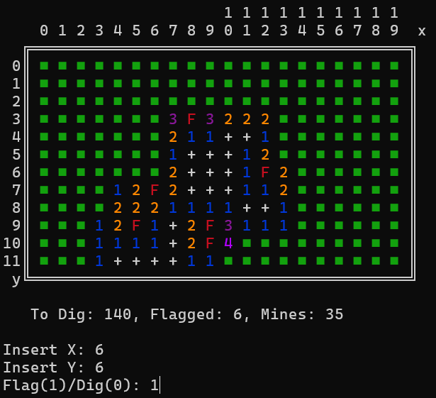

# Minesweeper

This is a simple implementation of the **Minesweeper** game in Java. The game is played on a grid where some cells contain mines, and others show the number of adjacent mines. The objective is to uncover all the cells without hitting any mines.

The game **draws the grid directly on the terminal**, with different colors for different cells.

## Requirements

- **Java 21 or later** installed on your system.
- **Windows environment** (if you want to use the `.bat` file to compile and run).

## Running the Program

### 1. Compile the Game

To **compile** the game, you can use the provided **`.bat`** file. This batch script will:

- Compile the Java source files.
- Create the executable JAR file.

#### Using the Batch File:

1. **Open a command prompt** and navigate to the directory where your files are located.
2. **Run the `build.bat` file** by typing:
    ```bash
    build.bat
    ```

### 2. Set arguments and Run

The program requires **three arguments** to work:

- **`rows`**: The number of rows in the grid (max 100).
- **`cols`**: The number of columns in the grid (max 100).
- **`nMines`**: The number of mines in the grid.

**Example usage**:
```bash
java -jar minesweeper.jar 12 20 35
```
This command would start the Minesweeper game with a 12x20 grid and 35 mines.<br>
The game continues until all non-mine cells are uncovered or a mine is hit.


